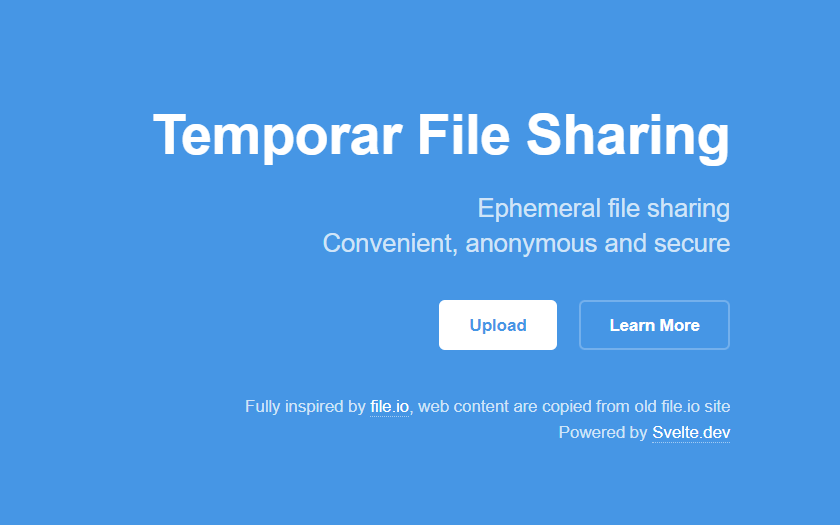

# Temporar

S3-Backed [File.io](https://file.io) clone in Go (No Other Databases!), Simply upload a file, share the link, and after it is downloaded, the file is completely deleted. For added security, set an expiration on the file and it is deleted within a certain amount of time, even if it was never downloaded.



## Storage

- [x] AWS S3
- [x] Cloudflare R2
- [x] Minio
- [x] Wasabi

## Deployment

Using `Dockerfile` or manually:

```sh
cd frontend
npm i
npm run build
cd ..
go build -trimpath
```

Makesure you already set ENV VAR before deploying
